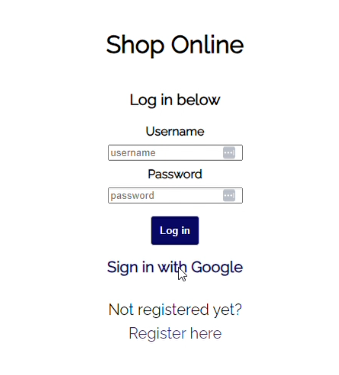
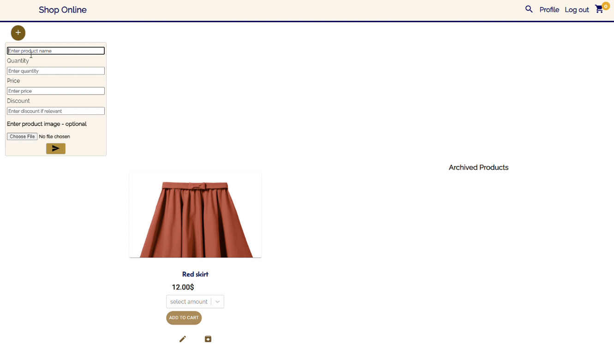
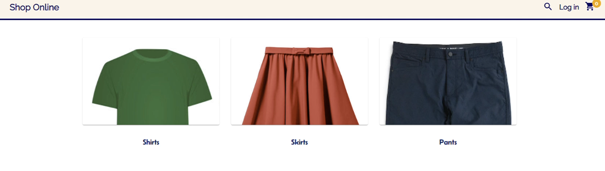
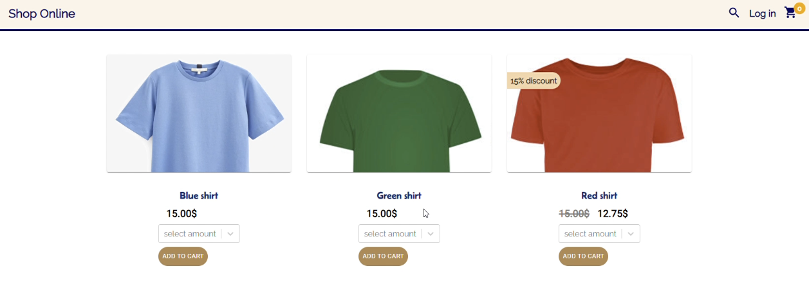
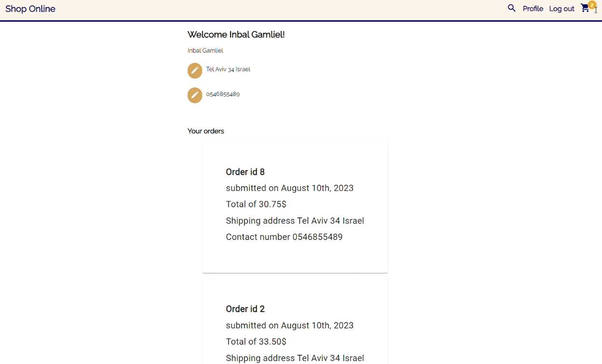

# Shop Online
### Developed by Inbal Gamliel

This web app was created as an e-commerce platform for a clothing company.
[Live preview of the web app](https://bit.ly/3rmoyda).

### Main features- Backend
**Users can choose how to sign up for the app**

- Regular registration where they use a valid email and create their own password and username.
- Google sign up where they use their google account to register.
If a user chooses to sign up using his Google account the following will occur-

His email will be set as the email and his google display name will be set as the nickname. His password will not be saved in the DB. His profile id will be saved under a specific table (Federated Credentials) in the DB that represents a Google sign up. If the user signed up using Google, the next time he will log in, the existing user record will be found via its relation to the Google account (using his Google profile id).

**Uploading images**
The admin user can create categories and products. I used the Multer package in order to implement image upload. This way when an admin user creates a category / product he can also add an image to it.
The images are saved in an 'images' folder in the backend server. The images information is saved to the DB to a specific images table. Each cateogry / product that an image was uploaded to it will get the image_id in the DB.

**User session used for cart data**
When a user shops on the web app, the products and the quantity is not saved to a table in the DB, it is saved to the user session.
If the user wants to make a purchase it will use the products data saved to the user session to retrieve relvenat information from the DB. For example, using the product id it will get the current price, and discount if relevant.

**Search for products**
Users can search for products. Once a user enter a search word it will be queried in the products table in the DB and the relevant products, and their information, will be displayed.

### Main features- Frontend
**Redux**
In this web app there's a lot of data that is used across components. That is why Redux cam in handy. I used it in order to manage the state of the different components- categories, products, user profile, orders and cart.
It allowed me to update the components states much more easily and maintain practices of clean code.

**useMemo**
This react hook was used for calculcation of amount of products and total price. Each time a user added a product the amount and price were added using this hook. The value is memoized, cached, and when a product or cart are changed it uses it in the calculation.

